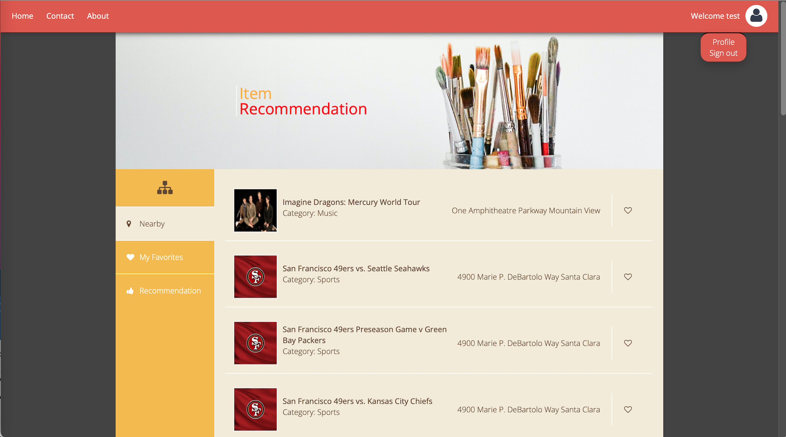

# Ticket+: Java Web Service Development-Event Search and Ticket Recommendation
 - Developed an interactive web page for users to search events and purchase tickets.
 - Improved personalized business recommendation based on search history and favorite records.
 - Created Java servlets with **RESTful** APIs to handle HTTP requests and responses.
 - Built relational (**MySQL**) and non-relational database (**MongoDB**), to obtain real business data from Yelp API.
 - Designed algorithms (e.g., **content-based recommendation**) to implement business recommendation.
 - Deployed server to **Amazon EC2** to handle 150 queries per second tested by Apache JMeter
 - Designed an interactive web page utilizing **AJAX** technology (**HTML, CSS and JavaScript**).
 
## Features
 - Authentication systems
 - Liking items
 - Real Time Like Updates
 - Recommendation items based on user's like and location

## HomePage
 
 
## Website 
 These web pages have already been deployed on the Amazon EC2. You can check it by the [link](http://18.222.248.176:8080/universeplane/ "Title"). 
